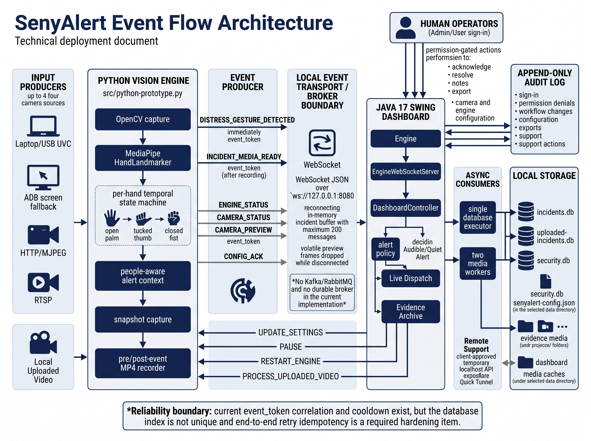

# SenyAlert Architecture Overview & Deployment Runbook

## Purpose and deployment boundary

SenyAlert is a local, event-driven distress-triage desktop application. A Python vision engine observes up to four configured camera inputs, detects the Signal for Help sequence, and sends structured events to a Java Swing dispatch dashboard. The dashboard stores incidents and evidence in local SQLite databases, selects an audible or quiet alert, and gives authorized operators an incident workflow.

The repository supports a source-based, single-workstation deployment. It has no completed installer, Docker image, external message broker, or CI/CD deployment pipeline. This runbook documents the supported topology and identifies production hardening separately.

## 1. Event Flow Architecture

### Component roles

| Event-driven role | SenyAlert component | Responsibility |
| --- | --- | --- |
| Input producers | UVC/webcam, ADB fallback, MJPEG, RTSP, or uploaded video | Produce frames for analysis; they are not broker publishers. |
| Event producer | `src/python-prototype.py` | Detects a qualifying temporal hand-sign sequence, saves an immediate snapshot, creates a unique `event_token`, and publishes `DISTRESS_GESTURE_DETECTED`. It later publishes `INCIDENT_MEDIA_READY` when the post-event MP4 is closed. |
| Event broker/transport | Local WebSocket at `ws://127.0.0.1:8080` | Carries JSON between Python and Java. It is not RabbitMQ, Kafka, or a durable queue. Incident messages can wait in memory during reconnect; previews are dropped. |
| Protocol consumer | `EngineWebSocketServer` | Parses each JSON message and routes it according to its `event` field. Malformed messages are rejected without closing the dashboard. |
| Application consumer | `DashboardController` | Applies the alert policy, requests persistence, refreshes the UI, plays an alert when appropriate, and processes later media-ready updates. |
| Persistence consumer | `SqliteIncidentRepository` | Serializes writes and stores incident facts, evidence, status, and token in local SQLite. |
| Human consumer | Authorized local operator | Reviews the pending incident, acknowledges or resolves it, adds an operator note, and exports evidence when permitted. |

### Architecture diagram



*Figure 1. SenyAlert event flow from camera and uploaded-video producers through the local WebSocket transport, Java dashboard consumers, storage, audit history, and human operator actions.*

### Text flow

1. A camera worker supplies the latest frame; network sources discard stale frames.
2. The Python engine validates the temporal gesture, confidence, and cooldown, creates an `event_token`, saves a snapshot, starts recording, and sends `DISTRESS_GESTURE_DETECTED`.
3. Java routes the event, applies the alert policy, and asynchronously creates a `PENDING` SQLite incident. Live Dispatch can alert the operator immediately.
4. After recording, `INCIDENT_MEDIA_READY` updates the same token with the MP4 status. Permission-checked operator actions are recorded in the audit history.

## 2. Environment Configuration

### Prerequisites

- Windows workstation; JDK 17+; Maven; Python dependencies from `requirements.txt`
- At least one supported source for live detection
- `cloudflared` and outbound Internet only for Remote Support

Copy `senyalert.env.example` to `senyalert.env` beside the launcher. Use `NAME=value` entries. Process-level variables override file entries, including intentionally blank values. Do not place the real environment file in documentation, evidence exports, or source control.

### Supported variables

| Variable | Requirement and purpose |
| --- | --- |
| `SENYALERT_ENV_FILE` | Optional selector for another existing environment file. |
| `SENYALERT_DATA_DIR` | Optional existing directory for databases and settings; it is not created automatically. |
| `SENYALERT_PROJECT_ROOT` | Optional project path when automatic engine/tool discovery is unsuitable. |
| `SENYALERT_PYTHON` | Optional Python executable path, without arguments. |
| `SENYALERT_ENGINE_AUTOSTART` | First-run default. The saved dashboard setting becomes authoritative. |
| `SENYALERT_WS_URL` | Engine endpoint; supported default: `ws://localhost:8080`. |
| `SENYALERT_CLIENT_ID` | Remote Support only: stable 8-128 character installation ID. |
| `SENYALERT_CLIENT_NAME` | Optional Remote Support display label. |
| `SENYALERT_SUPPORT_SECRET` | Remote Support only: unique secret of at least 32 characters. |
| `SENYALERT_CLOUDFLARED` | Optional `cloudflared` executable path; defaults to `cloudflared` on `PATH`. |
| `SENYALERT_SUPERADMIN_PASSWORD_HASH` | Developer-computer-only PBKDF2 verifier; never place it on a client. |
| `CAMERA_ENTRY_SOURCE` (or another valid name) | Optional camera source referenced as `env:VARIABLE_NAME`. |

`SENYALERT_ENV_LOADED` is internal child-process state and must not be added to the file. The core application has no database username/password because it uses local SQLite. It also has no cloud API key requirement.

### Broker setup

**Local and supported:** Java binds the WebSocket server to loopback port 8080. Keep `SENYALERT_WS_URL=ws://localhost:8080` and confirm the dashboard reports the engine connected and camera online.

**Production boundary:** Keep port 8080 loopback-only. The current transport does not support distributed workstations. That redesign requires an authenticated TLS broker, durable queues, acknowledgements, retry limits, dead-letter handling, centralized identity, and load testing.

## 3. Deployment Procedure

### Pre-deployment safeguards

1. Confirm the target workstation and data directory.
2. Stop SenyAlert and preserve a consistent copy of its databases, settings, evidence, and audit files. Do not copy SQLite while it is being written.
3. Record each camera ID, location, source, and expected resolution. Keep credentials out of commands, screenshots, and logs.

### Install, configure, validate, and launch

1. Verify prerequisites:

   ```powershell
   java -version
   mvn -version
   python --version
   ```

2. Install Python dependencies from the repository root:

   ```powershell
   python -m pip install -r requirements.txt
   ```

3. Copy the local template, then fill only required values:

   ```powershell
   Copy-Item senyalert.env.example senyalert.env
   ```

4. Compile and run non-camera checks:

   ```powershell
   Set-Location java-dashboard
   mvn compile
   mvn "-Dexec.mainClass=com.senyalert.security.SecuritySmoke" exec:java
   mvn "-Dexec.mainClass=com.senyalert.tools.ExportSettingsSmoke" exec:java
   mvn -q compile exec:java "-Dexec.mainClass=com.senyalert.remote.RemoteSupportSmoke"
   Set-Location ..
   python src/vision-quality-smoke.py
   ```

   The candidate must compile and each selected smoke check must succeed. The support smoke starts no tunnel.

5. Launch the application:

   ```powershell
   python senyalert.py run
   ```

6. Create the first local administrator (12-128 character password; no default credentials).
7. Configure at least one camera with a unique ID and location. The maximum is four.
8. Set **Start engine on startup**, or use **Start Engine** after sign-in.
9. Supervise one acceptance event: connected engine, online camera, one pending incident, readable snapshot, ready video, working acknowledge/resolve, and recorded audit actions.
10. Configure optional Remote Support from `docs/remote-support.md` and verify client stop/expiry and audited credential-copy actions.

### Idempotency and safe retry handling

SenyAlert assigns one `event_token` to the initial incident and its media update. Cooldowns, serialized writes, and media updates by token reduce repeated detections and correlate the two stages.

This is not complete delivery idempotency: `event_token` has a normal index, not a unique constraint, and the initial insert always creates a row. A retransmission could create a duplicate.

Before enabling broker retries or claiming production reliability, make idempotency a release gate:

1. Require a stable nonblank token and enforce token uniqueness per archive through an additive migration.
2. Use atomic insert-or-return-existing logic (`INSERT ... ON CONFLICT DO NOTHING`, then lookup).
3. Acknowledge only after commit; retry unacknowledged events with bounded backoff.
4. Keep media-ready processing as an update by token and count duplicate-token conflicts.
5. Verify that replaying one test token still produces one incident and one alert.

Until then, avoid automated distress-event replay and inspect tokens/timestamps when duplicates are suspected.

### Rollback

If validation fails, stop the application, preserve diagnostic data, and return to the prior tested package and consistent backup. Do not overwrite the only incident archive. Repeat sign-in, database, camera, event, evidence, and audit checks before service resumes.

## 4. Monitoring, Alerting, and Poison Events

### Metrics to track

| Area | Minimum metric or check | Why it matters |
| --- | --- | --- |
| Event transport | Connected state, reconnects, disconnect duration, buffer depth/drops | Broker health. |
| Lag/throughput | Detection-to-commit/display time; events per camera; duplicate tokens | Backlog or event storm. |
| Camera/engine | Online state, read errors, reconnects, FPS/resolution, processing time | Source or detector failure. |
| Operations | Pending count/age and acknowledge/resolve time | Operator workload. |
| Evidence/storage | Snapshot/video failures, media delay, SQLite errors/latency, DB size, free disk | Evidence availability and capacity. |
| Security/host | Failed sign-ins, denials, audit-chain result, support activity, CPU/memory/process restarts | Misuse, tampering, or saturation. |

The UI shows engine/camera state, pending incidents, evidence status, and audit history, but has no centralized metrics service or remote notifications. Operational deployment needs structured logs and visible threshold warnings.

### Poison-pill procedure

Malformed JSON is caught and reported without terminating the dashboard. There is no dead-letter queue for a valid-looking event that repeatedly fails.

If one event repeatedly fails:

1. Stop/pause an event storm without deleting databases or evidence.
2. Record the type, token, camera, time, sanitized error, and payload hash; exclude credentials and private evidence.
3. After a bounded attempt count (for example, three), quarantine the message and continue with later events.
4. Alert an administrator and preserve logs, audit records, and a database backup.
5. Correct the fault, replay once through the idempotent path, and verify one incident with correctly correlated media.

Implementing durable quarantine, retry counters, and alert thresholds is a production-hardening task; it is not present in the current source-based demo.

## Source anchors

- `README.md`
- `senyalert.env.example`
- `docs/environment-setup.md`
- `docs/access-and-audit.md`
- `docs/remote-support.md`
- `src/python-prototype.py`
- `java-dashboard/src/main/java/com/senyalert/infrastructure/EngineWebSocketServer.java`
- `java-dashboard/src/main/java/com/senyalert/controller/DashboardController.java`
- `java-dashboard/src/main/java/com/senyalert/repository/SqliteIncidentRepository.java`
- `java-dashboard/src/main/java/com/senyalert/repository/SchemaMigrator.java`
